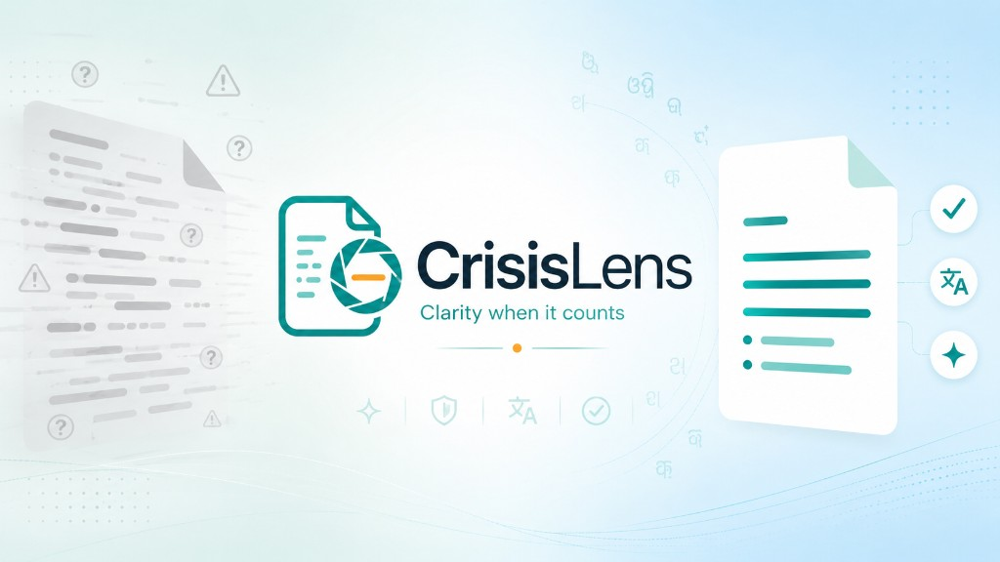
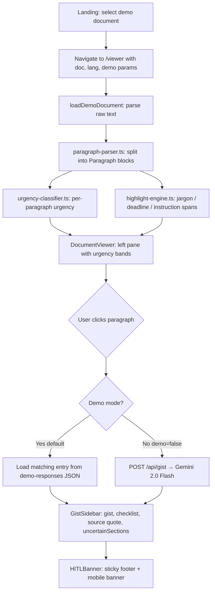

<p align="center">
  
</p>

# CrisisLens

**A split-pane crisis document translator and simplification workspace. Keep the original visible, highlight risk, and translate legal/medical jargon into plain language.**

[](https://github.com/Stormynubee/CrisisLens/releases/tag/v1.0.0)
[](https://crisislens-ashen.vercel.app)
[](LICENSE)
[](https://nextjs.org/)
[-teal?style=flat-square)](https://crisislens-ashen.vercel.app/viewer?doc=hospital-discharge&lang=or&demo=true)

| | |
|---|---|
| **Live app** | [https://crisislens-ashen.vercel.app](https://crisislens-ashen.vercel.app) |
| **Primary demo URL** | [Hospital discharge · Odia · demo mode](https://crisislens-ashen.vercel.app/viewer?doc=hospital-discharge&lang=or&demo=true) |
| **Event** | USAII Global AI Hackathon 2026 — High School Track — **Challenge 1A: Crisis-to-Action Translator** |
| **Builder** | Hansraj Tiwari — KV Dharamgarh, Kalahandi, Odisha, India |
| **Demo video** | *Placeholder — link to be added after recording* |

---

## Table of Contents

1. [The Problem](#1-the-problem)
2. [The Solution](#2-the-solution)
3. [Impact](#3-impact)
4. [AI and Analytics Reasoning](#4-ai-and-analytics-reasoning)
5. [Data Pipeline](#5-data-pipeline)
6. [Repository Structure](#6-repository-structure)
7. [Installation and Running](#7-installation-and-running)
8. [Demo Mode (Offline-First for Judges)](#8-demo-mode-offline-first-for-judges)
9. [Responsible AI and Human-in-the-Loop](#9-responsible-ai-and-human-in-the-loop)
10. [Verification Scripts](#10-verification-scripts)
11. [Team and Credits](#11-team-and-credits)

---

## 1. The Problem

*Rubric: Problem Understanding (30%)*

On NH-56 near Kalahandi, Odisha, a highway accident does not end at the crash site. Families leave the hospital with discharge summaries, insurance forms, and follow-up letters written in dense English medical and legal language. The same pattern appears in government rejection notices and school circulars during heat waves or administrative deadlines.

**Sunita** (illustrative persona for our demo narrative) lives in rural Kalahandi. Her husband was discharged after a road accident. The hospital gave her an English discharge summary. She had roughly **48 hours** to submit insurance paperwork, but she could not read the medication names, follow-up windows, or warning signs buried in the letter. A missed deadline or wrong dosage is not a UX problem — it is a safety and livelihood problem.

CrisisLens addresses this gap: not by replacing the document, but by helping people **read it under stress** while the original stays visible and authoritative.

---

## 2. The Solution

*Rubric: Solution Design (20%)*

CrisisLens is **not** a black-box chatbot. It is a **paper-plain visual workspace**: the official document on the left, plain-language guidance on the right, with deterministic urgency cues so judges can see that risk labels come from rules — not model guesses.

| Region | Width | Role |
|--------|-------|------|
| **Left pane** | 55% | Original document with paragraph blocks, inline highlights (jargon, deadlines, instructions), and vertical color-coded urgency bands (`CRITICAL`, `TIME-SENSITIVE`, `INFORMATIONAL`). |
| **Right pane** | 45% | Plain-language gist, suggested action checklist, source quote from the selected paragraph, and a sticky Human-in-the-Loop (`HITL`) banner (`ShieldAlert` icon). |

**Routes**

| Path | Purpose |
|------|---------|
| `/` | Landing — document picker, language selector, Analyze → viewer |
| `/viewer?doc=&lang=&demo=` | Split-pane workspace |
| `/api/gist` | Live paragraph gist (POST, Gemini) — used only when demo mode is off |
| `/api/urgency` | Deterministic urgency check (POST) |

**Three demo documents** (no file upload in v1):

- `kv-heatwave` — school heat-wave circular
- `hospital-discharge` — post-accident discharge summary (primary video demo)
- `pm-kisan-rejection` — government payment rejection with appeal window

---

## 3. Impact

*Rubric: Impact*

| Who | How CrisisLens helps |
|-----|----------------------|
| Rural families in Odisha | Read discharge and government letters in **Odia** without losing the English original |
| Caregivers under time pressure | See **deadlines and urgency** before reading every sentence |
| Judges and validators | Run the app in **demo mode** with zero API keys in under 3 seconds |

**Design choice:** One paragraph in, one gist out. That keeps token use low, avoids whole-document hallucination, and matches how people actually read crisis letters — section by section, not as a chat thread.

---

## 4. AI and Analytics Reasoning

*Rubric: AI Reasoning (20%)*

### Deterministic urgency classifier

Urgency is **never** assigned by an LLM. `src/lib/urgency-classifier.ts` applies weighted keyword lists and regex patterns to map text to:

- `CRITICAL`
- `TIME-SENSITIVE`
- `INFORMATIONAL`

This prevents urgency badges from drifting with model temperature.

### Regex highlight engine

`src/lib/highlight-engine.ts` marks inline spans client-side:

| Type | Examples |
|------|----------|
| `jargon` | Medical/legal terms (`analgesic`, `antipyretic`) |
| `deadline` | Dates and windows (`within 48 hours`, `30 days`) |
| `instruction` | Action phrases (`report immediately`, `do not`) |

Highlights render in `HighlightedText` inside clickable `ParagraphBlock` components.

### In-situ generative translation (live mode only)

When **demo mode is off** (`?demo=false`) and `GEMINI_API_KEY` is set:

1. User clicks one paragraph.
2. Client POSTs to `/api/gist` with that paragraph only.
3. `src/lib/gemini.ts` calls **Gemini 2.0 Flash** via `@google/generative-ai` (direct SDK — **not** Vercel AI SDK or the `ai` package).
4. `src/lib/prompts.ts` enforces JSON output, no hallucination rules, and localized responses.

This design respects rate limits, keeps serverless payloads small, and avoids timeouts from whole-document prompts.

### Demo mode (default)

**Demo mode is on by default** (`demo !== 'false'` in `src/hooks/useDemo.ts`). Gists load from `src/data/demo-responses/*.json` with a short delay (~400 ms). **No `/api/gist` calls** are made. Judges should use:

```
https://crisislens-ashen.vercel.app/viewer?doc=hospital-discharge&lang=or&demo=true
```

### Language support (honest scope)

| Language | Demo gists | Notes |
|----------|------------|-------|
| **English** | Pre-cached JSON (`*-en.json`) | Full coverage for 14 key paragraphs |
| **Odia / ଓଡ଼ିଆ** | Pre-cached JSON (`*-or.json`) | Required for USAII video; Noto Sans Oriya |
| **Hindi / हिन्दी** | Fallback template in `useDocument.ts` | UI + fonts; no `*-hi.json` in v1 (stretch goal) |

---

## 5. Data Pipeline



---

## 6. Repository Structure

```
CrisisLens/
├── public/
│   ├── logo.png              # Header + favicon
│   └── og-image.png          # Open Graph / social preview
├── scripts/
│   ├── log-paragraph-ids.ts  # Dev helper: list paragraph IDs for demo JSON
│   ├── phase2-verify.ts      # Documents + urgency classifier
│   ├── phase3-verify.ts      # Core modules + hooks
│   ├── phase4-verify.ts      # Highlight + viewer components
│   ├── phase5-verify.ts      # Gist sidebar + API routes
│   ├── phase6-verify.ts      # Demo response JSON integrity
│   ├── phase7-verify.ts      # Multilingual (EN / Odia / Hindi fallback)
│   ├── phase8-verify.ts      # HITL + responsible AI copy
│   ├── phase9-verify.ts      # Landing + viewer routes
│   └── phase10-verify.ts     # Deploy readiness + build
├── src/
│   ├── app/
│   │   ├── api/
│   │   │   ├── gist/route.ts       # POST: live Gemini gist
│   │   │   └── urgency/route.ts    # POST: deterministic urgency
│   │   ├── viewer/page.tsx         # Split-pane workspace (55/45)
│   │   ├── page.tsx                # Landing + document picker
│   │   ├── layout.tsx              # Metadata, OG image, fonts
│   │   └── globals.css             # Urgency bands, HITL, Odia/Hindi fonts
│   ├── components/
│   │   ├── DocumentViewer.tsx      # Left pane
│   │   ├── DocumentInput.tsx       # Demo document cards
│   │   ├── GistSidebar.tsx         # Right pane + uncertainSections UI
│   │   ├── ParagraphBlock.tsx      # Clickable blocks; mobile scroll to gist
│   │   ├── HighlightedText.tsx     # Inline highlight spans
│   │   ├── ActionChecklist.tsx     # Suggested actions
│   │   ├── Header.tsx              # Logo, Demo Mode badge, language
│   │   └── ui/
│   │       ├── HITLBanner.tsx      # role="alert" disclaimer
│   │       ├── LanguageSelector.tsx
│   │       ├── Badge.tsx
│   │       └── Button.tsx
│   ├── data/
│   │   ├── demo-documents/         # 3 source documents (raw text)
│   │   └── demo-responses/         # 6 files, 14 cached gists (EN + OR)
│   ├── hooks/
│   │   ├── useDocument.ts          # Load docs, select paragraph, gist fetch
│   │   ├── useDemo.ts              # Demo mode default true
│   │   └── useLanguage.ts
│   ├── lib/
│   │   ├── urgency-classifier.ts   # Rule-based urgency
│   │   ├── highlight-engine.ts     # Regex highlights
│   │   ├── paragraph-parser.ts     # Text → Paragraph[]
│   │   ├── prompts.ts              # Gemini system prompts
│   │   ├── gemini.ts               # @google/generative-ai client
│   │   └── types.ts                # Domain types
│   └── styles/
│       └── tokens.ts               # Design tokens (Tailwind theme is primary)
├── next.config.ts
├── tailwind.config.ts
├── package.json
├── LICENSE
└── README.md
```

### Repository organization guide

| Area | Convention |
|------|--------------|
| **Pages** | App Router only: `src/app/page.tsx` (landing), `src/app/viewer/page.tsx` (workspace) |
| **API** | Route handlers under `src/app/api/`; no Server Actions for gist |
| **Demo data** | Source docs in `demo-documents/`; cached gists in `demo-responses/` named `{docId}-{lang}.json` |
| **Secrets** | `.env.local` only; never commit. `.gitignore` excludes `.env*.local` and `.vercel` |
| **Stack lock** | `@google/generative-ai` only — do not add Vercel AI SDK or `ai` package |
| **Verification** | Run `npx tsx scripts/phaseN-verify.ts` after each phase; `phase10-verify.ts` before deploy |

---

## 7. Installation and Running

### Prerequisites

- Node.js 20+
- npm

### Clone and install

```bash
git clone https://github.com/Stormynubee/CrisisLens.git
cd CrisisLens
npm install
```

### Environment variables (optional for demo)

Create `.env.local` in the project root **only if** you need live Gemini gist (`?demo=false`):

```env
GEMINI_API_KEY=your_gemini_api_key_here
GEMINI_MODEL=gemini-2.0-flash
```

Never commit `.env.local`. Demo mode works without any API key.

### Development

```bash
npm run dev
```

Open [http://localhost:3000](http://localhost:3000).

### Production build

```bash
npm run build
npm run start
```

### Deploy to Vercel

```bash
npx vercel --prod
```

Set `GEMINI_API_KEY` in the Vercel dashboard only if you need live gist in production. Demo URLs do not require it.

---

## 8. Demo Mode (Offline-First for Judges)

Demo mode is **enabled by default**. The app reads pre-cached JSON from `src/data/demo-responses/` and does not call Gemini.

| URL param | Behavior |
|-----------|----------|
| *(omitted)* or `?demo=true` | Demo on — cached gists |
| `?demo=false` | Live mode — requires `GEMINI_API_KEY` |

**Quick start (no API key):**

```bash
npm run dev
```

Then open:

```
http://localhost:3000/viewer?doc=hospital-discharge&lang=or&demo=true
```

1. Landing loads three demo documents.
2. Click **Analyze Document** (or use the URL above directly).
3. Click a highlighted paragraph — gist appears in the right pane in ~400 ms.
4. Confirm **Demo Mode** badge in the header and **HITL** banner at the bottom.

**Production demo (judges):**

```
https://crisislens-ashen.vercel.app/viewer?doc=hospital-discharge&lang=or&demo=true
```

---

## 9. Responsible AI and Human-in-the-Loop

*Rubric: Special Awards — Responsible AI*

### Original text is source of truth

The left pane always shows the full document. The gist is a **translation layer** for one paragraph at a time, with a **source quote** shown above the plain-language summary in `GistSidebar`.

### HITL banner

`HITLBanner` (`ShieldAlert` icon, `role="alert"`) is pinned at the bottom of the gist sidebar and duplicated on mobile (`lg:hidden` footer on the viewer). Copy:

> AI guidance only — you make the final decision. CrisisLens translates and highlights. It does NOT give legal, medical, or safety decisions. The original document is the source of truth.

### Uncertainty sections (`uncertainSections`)

When the model or demo JSON flags ambiguous phrases (e.g. `analgesic/antipyretic`), they appear under an uncertainty block in the sidebar — not as a separate “logger” service, but as explicit `uncertainSections` on each `GistResponse`. Fallback gists also populate this field when no cached entry exists.

### Prompt guardrails

`src/lib/prompts.ts` forbids imperative medical/legal advice (`you must`, `you should`) and requires quoting uncertain source spans in JSON output.

### What we do not store

No user documents are persisted. Demo data is synthetic and pre-loaded for judging.

---

## 10. Verification Scripts

Run after setup or before submission:

```bash
npx tsx scripts/phase2-verify.ts
npx tsx scripts/phase3-verify.ts
npx tsx scripts/phase4-verify.ts
npx tsx scripts/phase5-verify.ts
npx tsx scripts/phase6-verify.ts
npx tsx scripts/phase7-verify.ts
npx tsx scripts/phase8-verify.ts
npx tsx scripts/phase9-verify.ts
npx tsx scripts/phase10-verify.ts
```

Typecheck and build:

```bash
npx tsc --noEmit
npm run build
```

---

## 11. Team and Credits

| Name | Role |
|------|------|
| **Hansraj Tiwari** | Founder, Lead Engineer |
| **Swayangjeet Nayak** | Frontend UI |
| **N. Arun Adhaven** | Pipeline Architecture |
| **Suryansh** | UI/UX Polish |
| **Ishant Agarawala** | Infrastructure and Deploy |
| **Anurag** | Core Team |

**School:** Kendriya Vidyalaya Dharamgarh, Kalahandi, Odisha, India

---

## Tech Stack

| Layer | Choice |
|-------|--------|
| Framework | Next.js 16 (App Router), React 19, TypeScript |
| Styling | Tailwind CSS 4, Framer Motion |
| Icons | Lucide React |
| LLM (live mode) | Google Gemini 2.0 Flash via `@google/generative-ai` |
| Hosting | Vercel |

---

## License

MIT — see [LICENSE](LICENSE).
